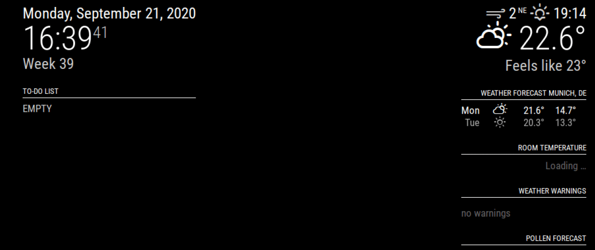

# Module: StopwatchTimer :hourglass_flowing_sand:
With this MagicMirror module you can display an alert-style timer or stopwatch on your mirror. The timer and stopwatch can be controlled via notifications or by using the [MM-Remote android app](https://github.com/Klettner/MM-Remote) :iphone:.  




## Dependencies ##
* For using sound, the native implementation without external dependencies (thanks @bugsounet) or [MMM-Sounds](https://github.com/jc21/MMM-Sounds) (needs to be set up separately) can be used 

## Set-up ##
This module can be downloaded by using Git. First make sure that you have installed Git on your system. 
Open the terminal/commandline and go to the modules directory of MagicMirror by typing
```
cd ~/MagicMirror/modules
```
Then clone this git repository:
```
git clone https://github.com/Klettner/MMM-StopwatchTimer.git
```
You can update this module by using
```
git pull
```
in the MMM-StopwatchTimer folder.
  
To use this module you also need to add it to the **config/config.js** file
```
modules: [
  {
    module: 'MMM-StopwatchTimer',
    config: {
      animation: true,
      sound: true,
      soundFile: 'buzz.wav', // This file must be in the sounds folder of MMM-StopwatchTimer or MMM-Sounds (depending on useNativeSound)
      useNativeSound: true,
      useAlertStyle: true
    },
  },
];
```
## Notification options ##
The following notifications can be used to control this module:
| **Notification** | **Description** |
|------------------|-----------------|
| ``` START_TIMER ``` | Starts a x-seconds timer. You need to specify the amount of seconds in the payload |
| ``` PAUSE_STOPWATCHTIMER ``` | Pauses the currently running timer or stopwatch. It will still be displayed on the screen |
| ``` UNPAUSE_TIMER ``` | If the timer was paused previously it will continue |
| ``` START_STOPWATCH ``` | The stopwatch starts running |
| ``` UNPAUSE_STOPWATCH ``` | If the stopwatch was paused previously it will continue |
| ``` INTERRUPT_STOPWATCHTIMER ``` | The mirror will stop displaying the timer or stopwatch which is currently shown |

## Configuration options ##
The following options can be configured in the config.js file:
| **Option** | **Description**|
|------------|----------------|
| ``` animation ``` | Controls if the timer/stopwatch should be animated. **Default:** *true* |
| ``` sound ``` | Controls if a sound should be played when the timer is done. **Default:** *true* |
| ``` soundFile ``` | Specifies the file that should be used to play sound **Default:** *'buzz.wav'* |
| ``` useNativeSound ``` | Specifies if the sound should be played natively (thanks @bugsounet) or via [MMM-Sounds](https://github.com/jc21/MMM-Sounds) (MMM-Sounds needs to be set up independently). **Default:** *false* |
| ``` useAlertStyle ``` | Specifies if you want to use `alert` style or popup bar with timer **Default:** *true* |

